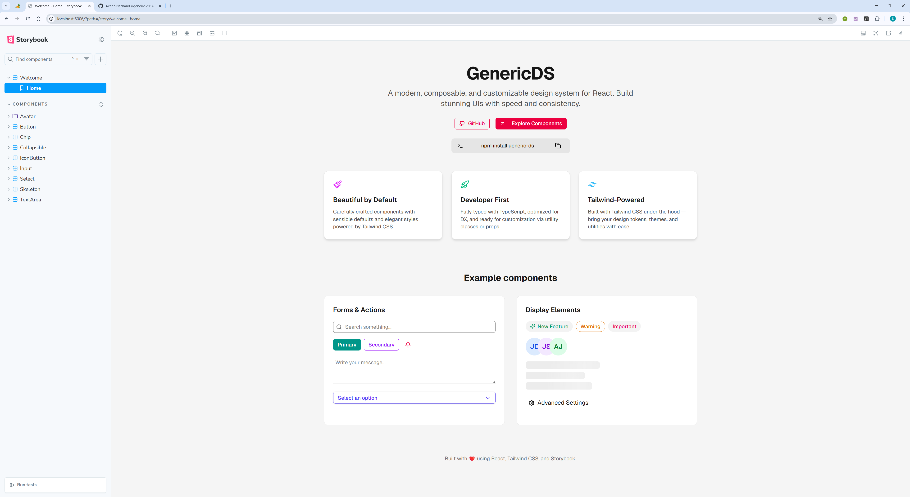

# GenericDS



GenericDS is an open-source and community maintained component library, aimed to become a generic design system which would enable developers to quickly build scalable, efficient and themed UIs without any hassle.

Visit the [GenericDS storybook](https:generic-ds.swapnilsachan.me) to explore all the available components.

Install GenericDS in your project using npm:

```sh
npm install generic-ds
```

or yarn:

```sh
yarn add generic-ds
```

## Features

- Flexible and themed UI components
- Community maintained
- Easy to use and customize
- Scalable and efficient

## Tech

This project is being built on top of following technologies (these may change as we make progress):

- [ReactJS](https://reactjs.org/) - A JavaScript library for building user interfaces
- [Storybook](https://storybook.js.org/) - An open source tool for developing UI components in isolation for React, Vue, and Angular
- [Chromatic](https://www.chromatic.com/) - A visual testing platform that helps you catch UI bugs before they reach production
- [NPM](https://www.npmjs.com/) - A package manager for JavaScript
- [TypeScript](https://www.typescriptlang.org/) - A typed superset of JavaScript that compiles to plain JavaScript (for type-safety ofc!)

And of course GenericDS itself will be forever open-source at [swapnilsachan03/generic-ds](https://github.com/swapnilsachan03/generic-ds).

## Running locally

```sh
git clone https://github.com/swapnilsachan03/generic-ds
cd generic-ds
npm install
npm run storybook
```

## Development

Want to contribute? Great! Here are the steps if this is going to be your first open-source contribution:

- Fork the repo
- Create a new branch (`git checkout -b feature/feature-name`)
- Make the appropriate changes in the files
- Add changes to reflect the changes made
- Commit your changes (`git commit -am 'Add some feature'`)
- Push to the branch (`git push origin feature/feature-name`)
- Create a Pull Request

Note that the changes you make must be in line with the [conventional commit messages](https://www.conventionalcommits.org/en/v1.0.0/) and the general codebase practices. Then only the PR will be approved and merged.

## License

MIT

**Free Software, Hell Yeah!**

## Storybook docs & related articles

1. [What is a Story?](https://storybook.js.org/docs/get-started/whats-a-story)
2. [Design Systems — Storybook with publishing to Chromatic and NPM](https://medium.com/@risinipiyathma1998/design-systems-storybook-with-publishing-to-chromatic-and-npm-aa39f55c3fae)
3. [How to create and publish your npm package](https://www.freecodecamp.org/news/how-to-create-and-publish-your-first-npm-package/)
